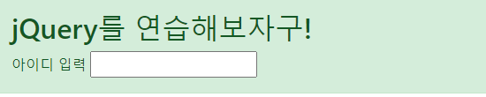
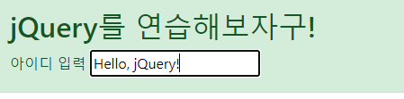
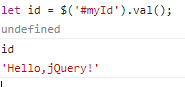
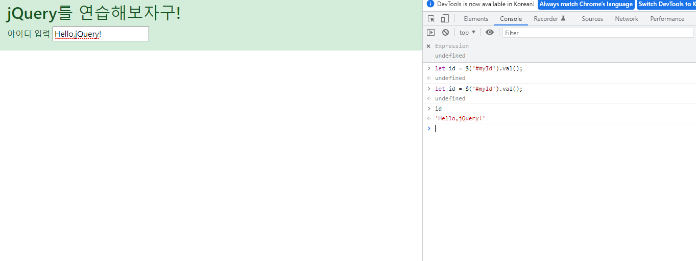
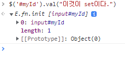
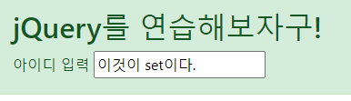

## input 박스의 값 다루기

### 학습 목표

- jQuery의 문법에 대해 익숙해진다.
- jQuery는 값을 조작하기 위해 주로 id를 사용한다. 직접 코드를 작성하며 사용법을 익힌다.
- get()메서드를 사용하여 input박스의 값을 변경하자.

### 실습

부트스트랩을 이용해 간단한 alert 컴포넌트를 만들었다. 그 안에 input을 넣어주자.

이번에 할 것은 위에 있는 input에 아이디를 입력하고, 콘솔창에서 이를 변수로 받는 것이다.

이제 콘솔창에서 아이디를 입력받기 위한 코드를 작성하자.

    let id = $('#myId').val();

id를 입력했더니 'Hello, jQurey!'라는 단어가 출력됐다. 
내가 작성한 코드의 의미가 무엇인지 하나하나 알아보자.

    let id
id라는 변수 선언

    $()
낯선 특수문자가 보인다. 이 '`$`' 문자는 jQuery를 의미하며, 접근할 수 있는 '식별자'이다.
괄호 안에 (`선택자`)가 들어간다.

제이쿼리의 선택자는 기본적으로 CSS와 동일하다.

- $('p'): element 셀렉터
- $('#'): id 셀렉터
- $('.'): class 셀렉터
 

    $('#myId')

위에서 학습한 것을 적용해보자. $는 제이쿼리의 식별자로서, 제이쿼리를 사용한다는 것을 의미한다.
'#myId'는 id 셀렉터. 즉, myId라는 아이디를 선택한다는 것을 의미한다.

    .val()

.val()의 정의는 다음과 같다.

- Get the current value of the first element in the set of matched elements.

즉, 첫번째 요소의 현재 value를 get하는 함수이다. 이 메서드는 아무런 값을 반환하지 않는다.

추가적으로 다음과 같이 사용할 수도 있다.

    .val(value)

이 메서드의 정의는 다음과 같다.

- Set the value of each element in the set of matched elements.

즉, 괄호 안에 들어있는 값을 matched elements에 설정하는 함수이다. 이 함수는 jQuery를 반환한다.

새로운 메서드를 알았으니 이를 적용시켜보자.

#### val(value) 사용하기

현재 콘솔의 상태이다. 여기서 val(value)메서드를 사용해 input 안에 들어있는 값을 set 해보자.

input을 건드리지 않았는데 박스 안의 값이 저절로 바뀌었다. 지금까지 명령어를 사용하여 input박스의 값을 다루는 실습이었다.