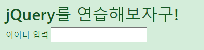
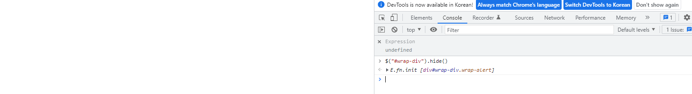
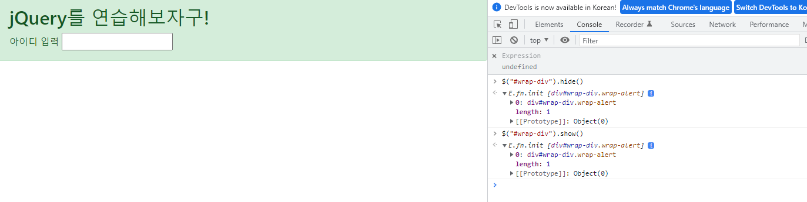

## div 숨기기, 보이기

### 학습 목표

- jQuery 메서드를 활용해서 요소를 숨기고, 보이게 해보자.

### 실습

이전에 사용했던 예제를 복사 - 붙여넣기 했다. 이번에 배울 개념은 hide()와 show()이다. 우선 alert 전체를 가싸는 wrap 클래스에 새로 아이디를 부여하자.

    id="wrap-div"

크롬을 열고 콘솔에서 hide()메서드를 사용해보자.

이번엔 show()메서드를 사용해보자.

이 실습을 통해 show()와 hide() 메서드를 사용하면 어떤 결과 발생하는지 이해하자.