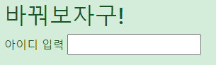

## 태그 내 텍스트 제어

### 학습목표

- input 박스 안이 아닌, 일반적인 태그에 있는 텍스트를 코드를 통해 제어할 수 있다.

### 실습

input 박스의 경우 .val() 메서드를 사용하여 내부 요소를 제어할 수 있었다. 하지만 일반적인 태그에 있는 text는 text()메소드를 사용한다. 직접 실습해보자.
    
    <h2 id="h2-post">jQuery를 연습해보자구!</h2>

위와 같이 h2에 id를 부여한다.

text()메소드를 사용하여 이를 제어해보자.

    $('#h2-post').text('바꿔보자구!');

이와 같이 일반적인 택스트 제어는 text()메서드를 사용한다.