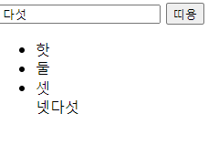

# append

## 학습 목표

- append 메서드를 이용해서 js로 html을 조작하자.

## 실습

- 버튼을 누르면 html을 추가하는 기능을 만들어 보자.

html을 하나 만들었다. 이제 띠용 버튼을 누르면 아래의 list에 추가되는 기능을 구현해야한다.

    function test() {
    let temp = $('#input').val()
    $('#list').append(temp)
    }

내가 입력한 값이 제대로 들어가는 것을 확인할 수 있다. 이번엔 list로 제대로 들어가게 코드를 변경하자.

    function test() {
    let temp = $('#input').val()
    $('#list').append(`<li>${temp}</li>`)
    }

성공!