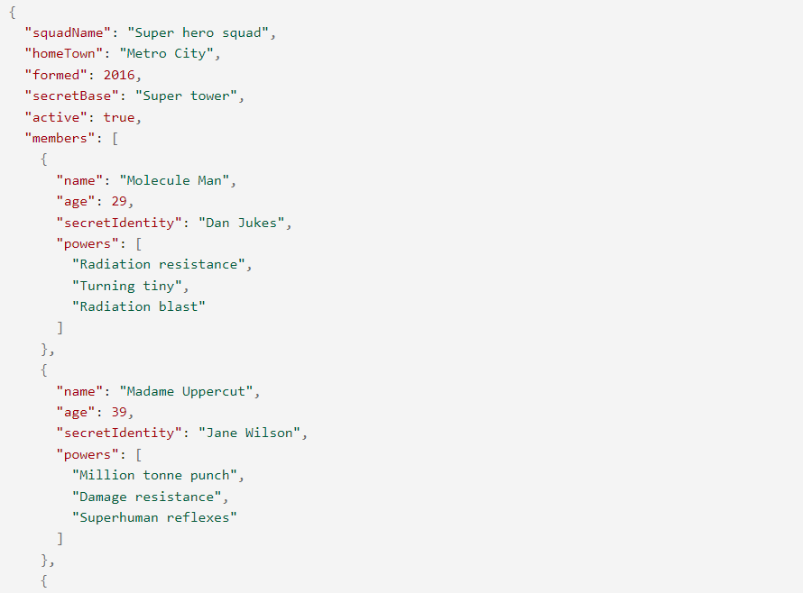

# JSON

## 학습목표

- JSON에 담긴 데이터를 이용하는 법 알기

### JSON의 정의

JavaScript Object Notation의 줄임말.

- 문자 기반의 표준 포맷
- JS 객체문법으로 구조화된 데이터를 표현
- 웹 어플리케이션에서 데이터를 전송할 때 사용 (서버 -클라이언트)

### JSON 구조

[MDN](https://developer.mozilla.org/ko/docs/Learn/JavaScript/Objects/JSON)을 통해 필요할 때 보면서 사용법을 익히자.